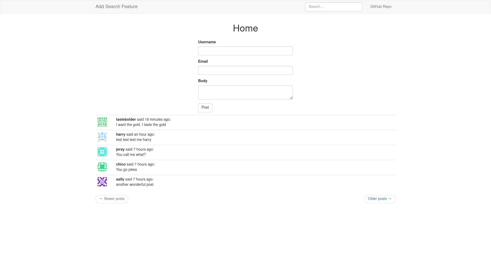

# Add A Search Feature To Your Flask App

| Add Post | Search Results |
| -------- | -------------- |
|  |  |

Demo app displaying how to use Elasticsearch to implement 'search' functionality from a model containing user-generated data.

### Table Of Content

- [Features](#features)
- [Technologies Used](#technologies-used)
- [Testing](#testing)
- [Reference](#reference)


## Features

- Save user posts in database
- Search for user posts
- Display relevant search results


## Technologies Used

- Flask
- Elasticsearch
- See [requirements file](requirements.txt) for specific details

## Testing

Unfortunately, a live demo with Elasticsearch is not available. Payment is required to enable such a service, which at the moment is not really necessary. You can run the application in your local machine to test it out.


- Clone this repo:

    ```python
    $ git clone git@github.com:GitauHarrison/search-functionality-in-flask.git
    ```

- Change directory to the cloned repo:

    ```python
    $ cd search-functionality-in-flask
    ```

- Create and activate a virtual environment:

    ```python
    $ mkvirtualenv venv # I am using virtualenvwrapper
    ```

- Install project dependencies in your active virtual environment:

    ```python
    (venv)$ pip3 install -r requirements.txt
    ```

- Update environment variables:

    ```python
    (venv)$ cp .env-template .env
    ```

- Configure elasticsearch (see [reference section](#reference) below)

- Run your Flask server:

    ```python
    (venv) flask run
    ```

- Paste the localhost URL into your favorite browser to access the GUI application


- Use the search form to query for data


## Reference

- [Install elasticsearch in your localhost](https://github.com/GitauHarrison/notes/blob/master/search/install_elasticsearch_localhost.md)
- [Install elasticsearch in your live linux server, eg Linode](https://github.com/GitauHarrison/notes/blob/master/search/install_elasticsearch_linode.md)
- [Implement search functionality using elasticsearch](https://github.com/GitauHarrison/notes/blob/master/search/implement_elasticseach.md)